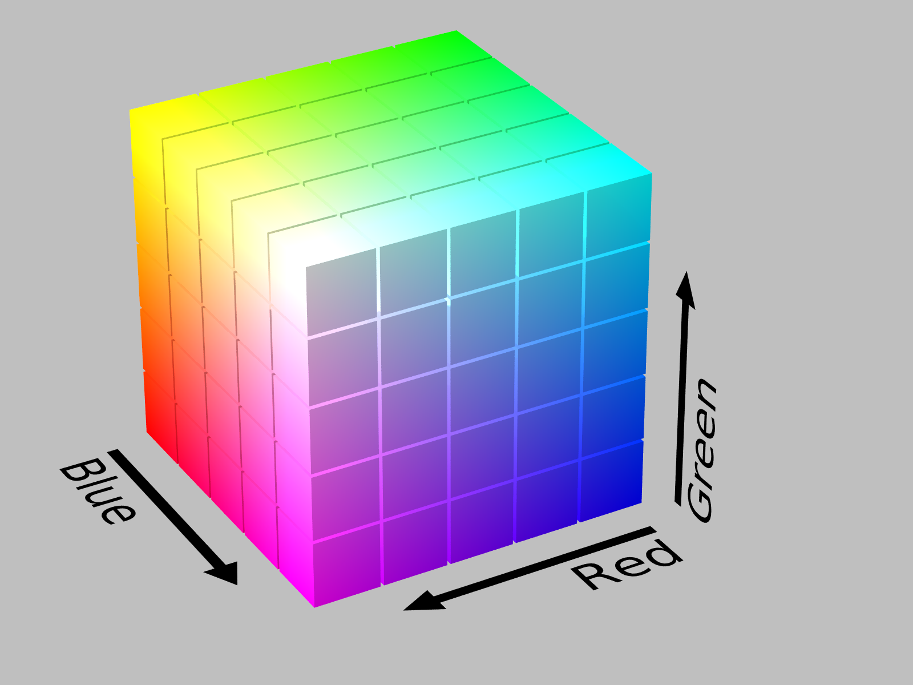

```{r, include = FALSE}
knitr::opts_chunk$set(
  collapse = TRUE,
  comment = "#>"
)
```

```{r setup}
library("colorpath")
library("tibble")
library("pals")
library("splattr")
```

The goal of **colorpath** is to help you design sequential (and diverging) color palettes that are effective and perceptually uniform.

At the moment, this vignette has an audience of one. As we get our legs under us, this vignette will become more-accessible.

This package uses the idea of a *color path*; I use this term to describe a trajectory through LUV colorspace from which one could extract sequential palettes for each of light and dark mode. 
This way, a light-mode palette and a dark-mode palette can look like they came from the same place.

There are a few principles this package rests on:

1. The HCL colorspace is a relatively intuitive way to describe colors.

1. The LUV colorspace is approximately perceptually-uniform; i.e. the Euclidean distance between two colors in LUV space corresponds well with the perceptual difference between those colors.

1. The Euclidean distance along a Bézier spline can be computed readily.

## Usage

The idea is to start with a data frame of HCL values - these will be coordinates of control-points for a Bézier spline.
If you want to learn more about the HCL colorspace, the folks who develop the **colorspace** package offer a [comprehensive introduction](http://hclwizard.org), a [color-picker](http://hclwizard.org/hclcolorpicker/) app, as well as other apps.

### Proscribe colors

This package has a such a sample HCL dataset:

```{r}
df_hcl_blues
```

A few things to notice here:

- there are three columns: `h`, `c`, and `l` for hue, chroma, and luminance

- luminance goes from low to high

- chroma begins and ends at zero, has a peak in the middle

- hue is constant

As you will see, this is not the most exciting set of blues. There should be more chroma.
At some point a better demonstration set should be chosen, but it gets the job done for now.
For example, there is no reason to have only three control points, and there is no reason you can't vary the hue. 
That said, I think it is a good idea that, for a given "single-ish hue" color path, the hue should vary linearly with the luminance.
s
We can convert this data frame into an LUV matrix:

```{r}
mat_luv_blues <- as_mat_luv(df_hcl_blues)

round(mat_luv_blues, 3)
```

The LUV space is a Cartesian form of the HCL space; HCL is a polar form of LUV. 
If `chroma` is zero, we should expect `u` and `v` both to be zero; we can see that this is not the case here.
This is because the function `as_mat_luv()` has an argument `chroma_min` whose default is `0.01`.

This is a trick used to preserve the hue of a color if its chroma is zero; a color with chroma value of 0.01 is imperceptible from thE corresponding color with a chroma value of 0.

Also, for convenience, `mat_luv_blues` is an exported dataset.

### Simple path

The coordinates-set `mat_luv_blues` represents a set of control points for a Bézier spline in LUV space. 

Let's create the spline:

```{r}
path_blues <- pal_luv_bezier(mat_luv_blues, rescale_path = FALSE)

path_blues
```

As you can see, this is a palette function. It takes a numeric input; however, instead of hex-codes, it returns LUV values:

```{r}
path_blues(c(0, 0.5, 1)) %>%
  round(3)
```

We can create a ggplot to see what this path looks like in the chroma-luminance plane. 
The plot function takes the palette function as an argument.

```{r}
plot_cl(path_blues)
```

In the plot, we see three things:

- points in the palette
- the control points for the Bézier spline
- for each point plotted from the palette, the color with the maximum chroma, given the hue and luminance.

One of the plot specifications is that the chroma axis be scaled proportionately to the luminance axis; we specify the aspect ratio to be one.

When we created `path_blues`, `pal_luv_bezier()` used an option `rescale_path = FALSE`. 
In the plot, you will see that the points in the palette are equally spaced in luminance. However, they are not equally spaced in terms of the distance along the path.  

Underneath the hood, we use the [**bezier**](https://CRAN.R-project.org/package=bezier) package to calculate the splines. 
It also has a function to calculate the distance along the path. 
We can use this information to rescale the input to the palette function to be perceptually uniform, insofar as LUV space is perceptually uniform.

### Rescaled path

In `pal_luv_bezier()`, the default value for `rescale_path` is `TRUE`. 
This invokes the distance calculation, which can take a few seconds, then rescales the function input:

```{r}
pal_blues_rescaled <- pal_luv_bezier(mat_luv_blues)

plot_cl(pal_blues_rescaled, label_hue = TRUE)
```

You'll notice a couple of things: the palette points are equally-spaced along the color path, and there are now labels for the value of the hue for each control point. 
These labels can be informative while developing a color path, but I can see how they might distract from a "finished product".

## Path vs. Palette

In my mind a color path contains palettes or parts of palettes - the idea would be, say for a corporate palette, to have a series of color paths, say a set of blues, oranges, and greens. From these paths sequential and diverging palettes could be composed from parts of these paths.

### Sequential palette (light mode)

In my mind, a sequential palette for light mode should have high luminance at the low end of the scale and low luminance at the high end of the scale. 

We can make such a palette by applying a rescaler function to the path function. 
One of the rescaler functions work using the luminance of a the path function - in essence, you specify the luminance values you want to form the ends of the color scale.

```{r}
# there is an opportunity to make this cleaner, I don't like to specify 
#  pal_blues_rescaled twice
rsc_light <- rescaler_lum(c(85, 40), pal_blues_rescaled)

pal_blues_light <- pal_luv_rescale(pal_blues_rescaled, rsc_light)

plot_cl(pal_blues_light)
```

### Sequential palette (dark mode)

For dark mode, the low end of the scale should have colors with low luminance; the high end of the scale should have colors with high luminance:

```{r}
# there's a shortcut now: pal_luv_rescale_lum()
pal_blues_dark <- pal_luv_rescale_lum(pal_blues_rescaled, c(35, 80))

plot_cl(pal_blues_dark)
```

To use a sineramp, the input needs to be an integer, the output needs to be hex. We have functions for those.

```{r}
pal.sineramp(as_pal_disc(as_pal_hex(pal_blues_dark)))
```

Here's a bit more detail on `as_pal_disc()` and `as_pal_hex()`; these each take a palette function, and each return a palette function:

```{r}
n <- 6
x <- seq(0, 1, length.out = 6)
x

# input x, output LUV
pal_blues_dark(x)

# input x, output hex
as_pal_hex(pal_blues_dark)(x)

# input n (number of colors), output hex
as_pal_disc(as_pal_hex(pal_blues_dark))(n)
```

At this point, I'm not terribly happy with the results. I do not perceive this to be as uniform as I hoped. Speculating:

- The "curtain" seems washed out at both ends. I think this is due to the sharp chroma peak 
- I am not as hopeful that individual palettes can be extracted from paths because I think we are asking too much of a path, especially because we are working with a luminance range of 60.
- Perhaps this can still be a useful tool to create related palettes?

Of course, I could have chosen a bad starting point and become discouraged.

What I think (hope) this package still offers is a way to design a palette reproducibly, capturing your design intent as code or parameters.

New set of ideas: let's define a surface in within the gamut such that the hue is a monotonic function of luminance.

We can create such a function.

```{r}
sfc_blues <- surface_hl(c(240, 260))

sfc_blues(seq(0, 100, by = 20))
```

We can plot what such a function looks like in the gamut:

```{r}
plot_surface_hl(sfc_blues)
```

Using this slice through the gamut, we can define an HCL data fram (then an LUV matrix) of control points using a data frame in CL, and a surface function:

```{r}
df_cl <- tibble(l = c(20, 50, 80), c = c(0, 150, 0))

df_hcl_blues_new <- df_hcl(df_cl, sfc_blues)
df_hcl_blues_new

mat_luv_blues_new <- as_mat_luv(df_hcl_blues_new)
```

Now you can create a palette:

```{r}
pal_blues_new <- pal_luv_bezier(mat_luv_blues_new)

plot_cl(pal_blues_new)
```

Perhaps palettes in the same "family" need not be drawn from the same colorpath - just from the same surface.

## Surfaces

This is an attempt to re-boot this vignette; once these sections are on their feet, they will start to "take over" the rest of the vignette.

Maybe I should just try to start at the start. 
Suffice to say that in its early form, these thoughts are not yet properly attributed. For me, it all starts with the colorspace package, and Achim Zeileis' talk at UseR!2019. 

In day-to-day use, colors on a computer display are expressed using hex-codes, e.g. [`#663399`](https://medium.com/@valgaze/the-hidden-purple-memorial-in-your-web-browser-7d84813bb416). 
As you likely know, hex-codes express the color in terms of three color channels, or dimensions: red, green and blue. 
These three dimensions form a **color space** called **sRGB**. A color space is a set of dimensions used to express colors.

The set of all colors that can be expressed using sRGB is called the sRGB **gamut**. 
It is a subset of the *visible* gamut, i.e. the set of all colors that can be perceived (generally) by the human eye. 
Because we are concerned with colors display on monitors, we concern ourselves with the sRGB gamut.

Here's what the sRGB gamut looks like in the sRGB color space
[[source](https://commons.wikimedia.org/wiki/File:RGB_Cube_Show_lowgamma_cutout_a.png)]:

```{r echo=FALSE, out.height=300, out.width=400, fig.cap='sRGB gamut in sRGB space, by Michael Horvath'}

```

In this representation, the origin (RGB = 0, 0, 0) is the color black, and is hidden in the back corner. 
The color white (RGB = 1, 1, 1) is the corner "nearest" us. 
This is an [additive](https://en.wikipedia.org/wiki/Additive_color) color space: the primary colors: red, green, and blue, are at three of the vertices. 
The secondary colors: cyan, magenta, and yellow, are at the three remaining vertices.

This colorspace has a concrete representation - it's very easy for us humans to think of it as a cube. 
But there's a problem with sRGB space, it's not **perceptually uniform**.
Consider two different colors (this would be a great place for an example). 
We can measure how far apart they are in a color space (using Euclidean distance); we can also make a judgment on how "differently" the two colors are perceived (by a human).
If a color space is perceptually uniform, then the color-space distance between two colors in that space is proportional to the perceptual difference between the colors.
The sRGB color space is not perceptually uniform.

The reason we are concerned with perceptual uniformity is because a continuous color-palette maps numerical values to  colors. 
We want to make sure that differences in color are interpreted as accurately as possible as differences in value.

There are color spaces that are more perceptually-uniform than sRGB. 
Consider the HCL color space, named after its dimensions: hue, chroma, and luminance. 
We can show the same set of colors, the sRGB gamut, in the HCL color space
[[source](https://commons.wikimedia.org/wiki/File:SRGB_gamut_within_CIELUV_color_space_isosurface.png)]:

```{r echo=FALSE, out.height=300, out.width=300, fig.cap='sRGB gamut in HCL space, by Michael Horvath and Christoph Lipka'}
knitr::include_graphics("figs/srgb-gamut-luv-space.png")
```

Here, we see a distorted view of the original cube. This can help us to define the terms:

- Luminance describes how light or dark a color is; a lighter color has greater luminance. The domain of luminance is 0 to 100.

- Chroma describes how colorful a color is; a grey has no chroma, a bright red has a lot of chroma. 
The maximum value of chroma depends on the hue and the luminance, i.e. the distorted cube. 
The largest value for chroma in the sRGB gamut is about 180 for a mid-luminant red.

- Hue describes the particular color, e.g. a red vs. a green. 
  It is cyclical; hue is expressed as an angle, in degrees.

Hue, chroma, and luminance give us an intuitive and tangible way to describe color, using a color space where distance is reasonably proportional to human perception.  

There is another color space we should introduce; it is identical to the HCL color space, except it uses Cartesian coordinates instead of polar coordinates. This is the LUV color space
[[source](https://commons.wikimedia.org/wiki/File:SRGB_gamut_within_CIELCHuv_color_space_isosurface.png)]:

```{r echo=FALSE, out.height=300, out.width=300, fig.cap='sRGB gamut in HCL space, by Michael Horvath and Christoph Lipka'}
knitr::include_graphics("figs/srgb-gamut-hcl-space.png")
```

The concept of luminance is the same as with HCL.
The coordinates U and V are the Cartesian equivalent of H and C. 
The LUV color space is less intuitive than the HCL color space, but it allows a straightforward calculation of Euclidean distance.

In this package, we want to:

- think and specify using the HCL color space
- calculate using the LUV color space
- express the colors using the sRGB color space (hex codes)

### Thoughts on continuous palettes

Luminance propels everything. Chroma used to create a longer path. 
Be careful with hue because differences in hue are perceived differently by folks with color-vision deficiency.  

Dark mode. Comparing prominence vs. the background.

```{r}
library("colorpath")
```

```{r}
sfc_cyan <- surface_hl(192.2)
sfc_blue <- surface_hl(265.9)
```

We get warnings (from ggplot2) when we render these plots because the second y-axis has a uses the surface-functions which, in these cases, have a constant hue. 

```{r}
plot_surface_hl(sfc_cyan)
plot_surface_hl(sfc_blue)
```

```{r}
sfc_multi_blue <- surface_hl(c(271, 215))
plot_surface_hl(sfc_multi_blue)
```

Let's think about some trajectories to plot along this surface. 
Want to think in terms of light mode and dark mode.

In light mode, let's set our luminance ceiling to 90; in dark mode, let's set the luminance floor to 30.

```{r}
dfcl_blues_light <- 
  tribble(
      ~l,      ~c,
      90.0,  30.0,
      75.0,  80.0,
      50.0,  80.0,
      30.0,  60.0,
      20.0,  40.0
  )
```

```{r}
dfhcl_blues_light <- df_hcl(dfcl_blues_light, sfc_multi_blue)

dfhcl_blues_light
```

```{r}
pal_blues_light <- 
  pal_luv_bezier(as_mat_luv(dfhcl_blues_light), rescale = TRUE)

plot_cl(pal_blues_light)
```

```{r}
hcl <- 
  pal_blues_light(seq(0, 1, 0.1)) %>% 
  farver::convert_colour(from = "luv", to = "hcl") %>%
  print()

sfc_multi_blue(hcl[, "l"])
```

The two plots seem inconsistent. 
The spline does not respect the surface. It respects only the control points, which are on the surface.

```{r}
blues_light_discrete <- as_pal_disc(as_pal_hex(pal_blues_light))

swatch(blues_light_discrete(11))

pal.sineramp(blues_light_discrete)
```

Let's try a variation on the theme to create a half-palette for a diverging-palette:

```{r}
dfcl_blues_div_light <- 
  tribble(
      ~l,      ~c,
      90.0,   0.0,
      85.0,  50.0,
      70.0,  80.0,
      50.0,  80.0,
      30.0,  60.0,
      20.0,  40.0
  )
```

```{r}
dfhcl_blues_div_light <- df_hcl(dfcl_blues_div_light, sfc_multi_blue)

dfhcl_blues_div_light
```

```{r}
pal_blues_div_light <- 
  pal_luv_bezier(as_mat_luv(dfhcl_blues_div_light), rescale = TRUE)

plot_cl(pal_blues_div_light)
```

```{r}
blues_div_light_discrete <- as_pal_disc(as_pal_hex(pal_blues_div_light))

swatch(blues_div_light_discrete(11))

pal.sineramp(blues_div_light_discrete)
```

### Dark mode

Here's my theory (and I'm sure it is not original): a sequential palette "move away" from the background color. 
For light mode, it start more luminant and become less luminant. 
For dark mode, it should start less luminant and become more luminant. 

In essence, you want the scale to emphasize the "interesting" data by placing those colors as far away from the background as possible.

Here, we assume that light mode has a white background (luminance 100), and that the dark-mode background has a luminance of 20.
This has the effect of shortening the available-luminance range for dark mode (values under 20 are inaccessible).

That said, let's look at what dark mode might look like here:

```{r}
dfcl_blues_dark <- 
  tribble(
      ~l,      ~c,
      35.0,  30.0,
      50.0,  80.0,
      75.0,  80.0,
      90.0,  30.0
  )

dfhcl_blues_dark <- df_hcl(dfcl_blues_dark, sfc_multi_blue)
```

```{r}
pal_blues_dark <-
  pal_luv_bezier(as_mat_luv(dfhcl_blues_dark), rescale = TRUE)

plot_cl(pal_blues_dark)
```

```{r}
blues_dark_discrete <- as_pal_disc(as_pal_hex(pal_blues_dark))

swatch(blues_dark_discrete(11), background = "#333", margin = 10)

pal.sineramp(blues_dark_discrete)
```


```{r}
dfcl_blues_div_dark <- 
  tribble(
      ~l,      ~c,
      35.0,   0.0,
      40.0,  40.0,
      50.0,  80.0,
      75.0,  80.0,
      90.0,  30.0
  )

dfhcl_blues_div_dark <- df_hcl(dfcl_blues_div_dark, sfc_multi_blue)
```

```{r}
pal_blues_div_dark <-
  pal_luv_bezier(as_mat_luv(dfhcl_blues_div_dark), rescale = TRUE)

plot_cl(pal_blues_div_dark)
```

```{r}
blues_div_dark_discrete <- as_pal_disc(as_pal_hex(pal_blues_div_dark))

swatch(blues_div_dark_discrete(11), background = "#333", margin = 10)

pal.sineramp(blues_div_dark_discrete)
```

A couple notes on this diverging palette: 

- To my eyes, the LUV space is not quite perceptually uniform.
  The first few colors in this palette, near the greys, seem closer together than the lighter colors do.
  
- For an actual diverging palette, I think I would cut the palette off at luminance around 80, as a consideration for the other side of the palette (not yet seen). 
  For example, I would not the light orange to appear too close to the light blue.  
  
There is a way to test this idea about perceptual uniformity.
There is now a function in colorpath, `get_distance()` that given an LUV palette-function and a number of intervals, calculates the perceptual distance covered by each of the intervals.

```{r}
get_distance(pal_blues_div_dark, n = 10)
```

This shows the "cie2000" perceptual-distance between adjacent colors. 
It does show a "lull" in the first part of the palette, although the leading value (~7.4) surprises me.

I think we can solve one problem with another here. 
We can use a Bézier spline only to define the luminance-chroma trajectory, then use the surface to define the hue according to the luminance. 
Although colorspace offers a bunch of parameters to define a palette function, colorspace's math uses the parameters with the same separation; the hue is calculated independently from the chroma.

By splining only on chroma and luminance, we lose effectiveness in the distance rescaling that the bezier package offers. However, using `get_distance()`, we could make our own rescaling - which may be more effective than Euclidean distance in LUV space.

### Interim summary

I think that defining surfaces can make our problem simpler because it separates our variables according to our concerns.

We could define surfaces to represent palette families: greens, blues, etc. 
We could define trajectories to represent palette type: light, light-diverging, dark, dark-diverging.

Surfaces are chosen with a few factors in mind:

- open up more chroma space
- fidelity to an organization's brand
- among singlish-hue surfaces, blues and oranges seem like default choices because of their contrast with each other, especially for folks with CVD 

Trajectories are also chosen with a few factors in mind, all of them have to do with the background color for each of light and dark mode.
All colors in all palettes should have luminance values at least 10-points different from the luminance of the background color (I choose 10 as an example, maybe the right value is 7). This means that if your dark-mode background has a luminance of 20, the minimum luminance for dark-mode palettes should be 30.

- for light mode, assuming a background luminance of 100, we could start the a trajectory with luminance 90, then end with a luminance that need not respect the luminance considerations of dark mode, i.e. we could go down to luminance 20. 
- for dark mode, we should start with a luminance at the luminance limit.
- for non-diverging palettes, we could start a trajectory with a reasonable chroma - no need to be "too grey".
- for diverging palettes, we need to start the trajectory with zero chroma, in order to respect the common point.
- again for diverging palettes, the end of each arm should be not-too-far from the maximum chroma, as the chroma is what will drive the contrast between the two extrema of a "combined" diverging palette. 

Perhaps a set of templates could be used for these trajectories, then adapted to the chroma peculiarities of each surface family.


## Joining palettes

### Diverging palette (light mode)

### Diverging palette (dark mode)


