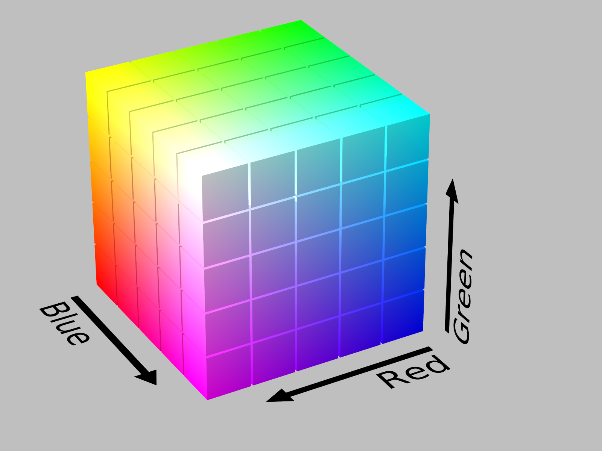
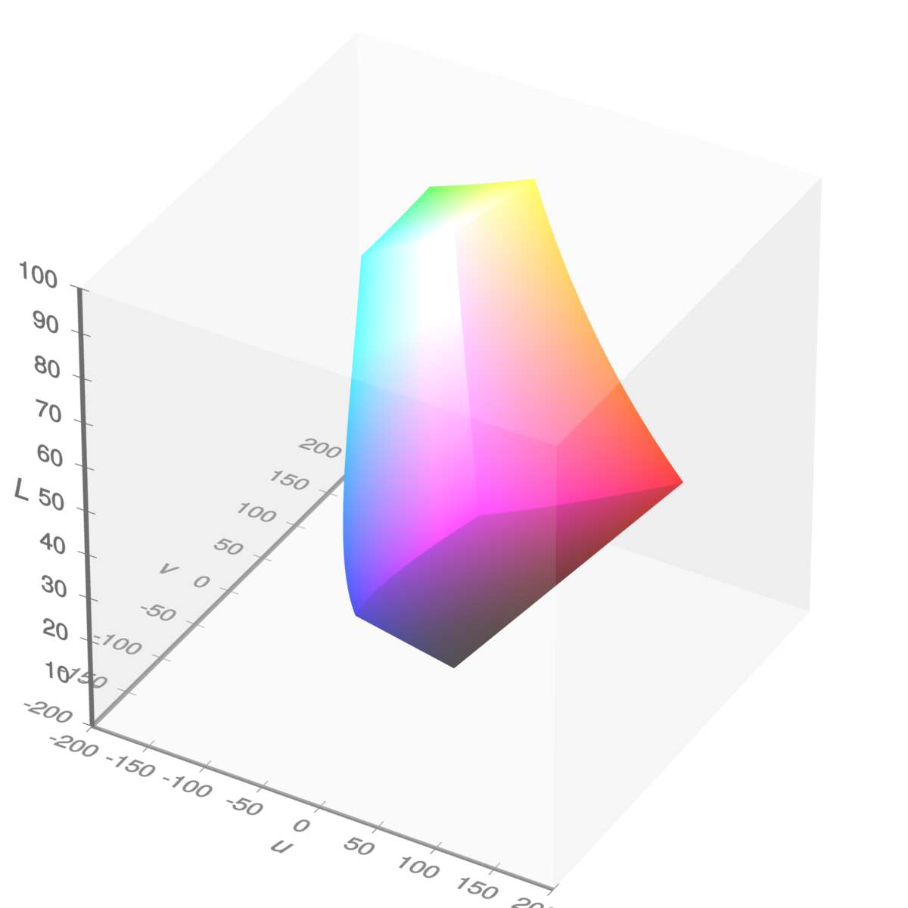

```{r, include = FALSE}
knitr::opts_chunk$set(
  collapse = TRUE,
  comment = "#>"
)
```

```{r setup}
library("colorpath")
library("colorspace")
library("pals")
library("thematic")
library("farver")
library("withr")
library("ggplot2")
```

The goal of this article is to make an entirely-too-brief overview of color theory as it applies to data visualization.
Unmercifully to both reader and author, this includes:

-   goals of color scales
-   sRGB color-space
-   CIELUV-like color-spaces
-   polar coordinates
-   color-vision deficiency
-   prominence from background
-   roles of luminance, chroma, and hue

Everything in this article is grossly oversimplified, perhaps even misunderstood, by the author.
Indeed, the following sections will no doubt seem like a maze of rabbit-holes that want nothing more than to divert our attention.
For this reason, we'll keep an example in mind to remind us of our destination.

Let's say you work for Acme Incorporated; your job is to create a collection of color scales to be used in all sorts of Acme data visualizations.

## Goals of color scales

Following @zeileis2020, there are three broad categories of color scales:

-   **categorical**: the goal is to distinguish one "thing" from another

-   **sequential**: the goal is to compare the value of one "thing" to another

-   **diverging**: same goal as sequential scales, but there is a reference value (maybe zero); we want to communicate clearly how a value compares with the reference value

```{r categorical, fig.height=2.75, fig.width=8}
swatchplot(
  categorical = okabe_ito(),
  sequential = rev(sequential_hcl(9, "blues")),
  diverging = rev(diverging_hcl(9, "Blue-Red 3"))
)
```

Color scales may have additional constraints:

-   Be accessible to folks with color-vision deficiency.
    As @wilke19 points out, although this may not be completely achievable for all cases, being mindful of the issue can help avoid the worst outcomes.

-   Be thematically consistent from one scale to another - that all the scales used in a set of visualizations look like they came from the same place.
    This may be an institutional concern, e.g. "the charts all have to look like Acme".
    For example, in the swatches above, the blues used in the sequential scale seem different from the blues used in the diverging scale.

Finally, everything may have to be done *twice*: for light mode and for dark mode.

## sRGB color-space

@smith_vanderwalt15 give a great overview of the journey a color takes from a computer monitor into the human brain.

This journey begins as a color is encoded for display.
In day-to-day use, colors on a computer display are expressed using hex-codes, e.g. [`#663399`](https://medium.com/@valgaze/the-hidden-purple-memorial-in-your-web-browser-7d84813bb416).
Hex-codes express color in terms of three color channels, or dimensions: red, green and blue.
These three dimensions form a **color space** called **sRGB**.

In sRGB, each dimension may take a value from 0 to 255:

```{r rebecca-blue}
farver::decode_colour("#663399")
```

The set of all colors that can be expressed using sRGB is called the sRGB **gamut**.
It is a subset of the *visible* gamut, i.e. the set of all colors that can be perceived (generally) by the human eye.
Because we are concerned only with colors displayed on monitors, we concern ourselves with the sRGB gamut.

Here's what the sRGB gamut looks like in the sRGB color space ([source](https://commons.wikimedia.org/wiki/File:RGB_Cube_Show_lowgamma_cutout_a.png)):

```{r srgb-gamut, echo=FALSE, out.height=300, out.width=400, fig.cap='sRGB gamut in sRGB space, by Michael Horvath'}

```

In this representation, the origin (0, 0, 0) is the color black, and is hidden in the back corner.
The color white (255, 255, 255) is the corner "nearest" us.
The primary colors: red, green, and blue, are at three of the vertices.
The secondary colors: cyan, magenta, and yellow, are at the three remaining vertices.

This colorspace has a concrete representation - it's very easy for us humans to think of it as a cube.
But there's a problem with using the sRGB space to design color scales.
Consider these three colors:

```{r blue_cyan_green}
blue_cyan_green <- c(blue = "#0000FF", cyan = "#00FFFF", green = "#00FF00")
farver::decode_colour(blue_cyan_green)
```

You can "see" that in the sRGB color-space, cyan is equidistant from both blue and green.
However:

```{r blue_cyan_green-display, fig.height=0.8, fig.width=2.30}
with_par(
  list(mar = c(0, 0, 0, 0)),
  swatchplot(blue_cyan_green, off = 0)
)
```

To my eyes, there is a much bigger perceptual difference between blue and cyan than there is between cyan and green.

A color space is **perceptually uniform** if the color-space distance between two colors in that space is proportional to the perceptual difference between the colors.
The sRGB color space is not perceptually uniform.

Perceptual uniformity is an important feature fo a color-space used to design color-scales.
For categorical scales, we can use the distance between colors as a measure of perceptual difference.
For sequential and diverging scales, we can use the differences between colors along a scale as a measure of the scale's effectiveness.

Of course, perceptual uniformity is in the eye of the beholder.
We will consider a family of such color spaces that descend from CIELAB

## CIELUV-like color-spaces

Defined in 1976, the CIELUV color space aims for perceptual uniformity; it describes color using dimensions:

-   $L^*$: lightness or luminance, measured from 0 (black) to 100 (white).

-   $u^*$: green-to-red, negative values indicate green; positive, red.

-   $v^*$: blue-to-yellow, negative values indicate blue; positive, yellow.

We can map the sRGB gamut (color cube) into the CIELUV color space:

```{r srgb-gamut-cieluv, echo=FALSE, out.height=300, out.width=300, fig.cap='sRGB gamut in CIELUV space, by Michael Horvath and Christoph Lipka'}

```

As you can see, it appears as a distorted cube.
If you like, here's a [rotating version](https://commons.wikimedia.org/w/index.php?title=File%3ASRGB_gamut_within_CIELUV_color_space_mesh.webm).
If we follow the "left" edge of the cube from bottom to top, we see blue at the lower vertex, then cyan and green nearer the top.
Notably, cyan and green appear closer together than cyan and blue.

We can check the numbers; first, the LUV coordinates:

```{r as_luv}
as_luv <- 
  blue_cyan_green %>%
  farver::decode_colour(to = "luv") %>%
  print()
```

Next, the Euclidean distances between them:

```{r luv_dist}
dist(as_luv)
```

This suggests that the CIELUV color space is more perceptually uniform than the sRGB color space.

There's a lot of color spaces based on dimensions of luminance, green-red, and blue-yellow - they each try to balance perceptual uniformity, hue consistency (is blue always blue?), and computational speed.
Nico Schlömer develops and maintains the Python package [colorio](https://github.com/nschloe/colorio/), which provides access to recently-developed color spaces, including CAM02-UCS, CAM16-UCS, and Jzazbz.
This package uses colorio, behind the scenes, to transform to-and-from these color spaces.

While using Cartesian coordinates makes distance calculations straightforward, the dimensions green-red and blue-yellow are not intuitive.
The dimensions become more intuitive by transforming these dimensions to polar coordinates.

## Polar coordinates

The CIELCH color space is a polar transformation of the CIELUV color space.
It offers the dimensions:

-   $L$: luminance, same as in CIELUV; values can be from 0 (black) to 100 (white).

-   $C$: chroma, the radial component of the polar transformation, 0 is a grey; describes colorfulness.

-   $H$: hue, the angular component of the polar transformation expressed as an angle with 0 being close to red, describes which color.

This is the color space used by the [colorspace](http://colorspace.r-forge.r-project.org/) package; where it is called HCL.
Here's a view of the sRGB gamut in HCL space, in the chroma-hue plane looking from "above":

```{r hcl-gamut-none}
pth_plot_polar(pth_mat_gamut(n_point = 9)) +
  ggtitle(
    label = "Edges of sRGB gamut in chroma-hue plane",
    subtitle = "Using CIEHCL space"
  )
```

We are looking at points on the edges of the sRGB gamut, i.e. an outline of the cube.
The cube is standing on its black vertex; both the white and black vertices are on the chroma-hue origin.

You can think of it as three high-luminance edges branching from the top, and three-low luminance edges branching from the bottom.
This plot can be useful to get a sense of how much chroma is available for a given hue.

Each of the color spaces used in this package has a Cartesian variation, which we use for distance calculations, and a polar variation, which we use when we're thinking and developing color scales.

## Color-vision deficiency

Our eyes have receptors for three colors: red, green, and blue.
The condition of having a deficiency in these receptors is called color-vision deficiency (CVD).
A given deficiency can be further identified:

-   Protan - red deficiency.

-   Deutan - green deficiency, this is the most prevalent.

-   Tritan- blue deficiency.

To keep straight which is which, I keep in mind the order of RGB and remember the Latin roots of the words, i.e. *pro*, *deu*, *tri*, which refer to the numbers *1*, *2*, *3*.

We can use the outline of the sRGB gamut to illustrate some models of CVD, with degree of severity varying from 0 (no deficiency) to 1 (completely deficient):

```{r hcl-gamut-full}
pth_plot_polar(pth_mat_gamut(), cvd = pth_cvd_grid_full()) +
  facet_grid(
    rows = vars(condition), 
    cols = vars(severity),
    labeller = labeller(severity = label_both)
  ) +
  ggtitle(
    label = "Edges of sRGB gamut in chroma-hue plane",
    subtitle = "Using CIEHCL space - simulating color-vision deficiency"
  )
```

This is a simulation, powered by colorspace.
It can help us build a mental model of how CVD manifests itself.
For me, as the severity of a given CVD condition increases, the dimension of the color space collapses from three to two (the luminance dimension does not appear in these plots).
The effect of deuteranopia does not appear very different from protanopia.

## Prominence from background

```{r dark-mode}
with_dark_mode <- function(code) {
  withr::with_par(
    new = list(bg = "#262626", fg = "#FFFFFF"),
    code
  )
}

swatchplot_dark <- function(x, ...) {
  swatchplot(x, border = "#3B3B3B", sborder = "#3B3B3B", ...)
}
```

With the proliferation of mobile devices, often used in low-light environments, dark-mode is becoming more-and-more popular.
The difficulty with dark-mode is that it has different rules for color scales than has light mode, and I am still trying to figure out which rules have changed.

There's a few of rules that (I think) I have sorted out:

-   The background of a plot is a (generally) non-chromatic color, i.e. a grey, with a luminance at or near white for light mode, and black for dark mode.
    All of the colors used for geometries should appear prominent from the background color.
    Prominence means that there is luminance separation between all colors and the background.

-   Sequential color-scales are driven by luminance.
    In light-mode, we associate darker colors with larger (or more interesting) values; darker colors are more prominent from the background.
    For dark mode, lighter colors are more prominent; in dark mode, a sequential scale should go from dark to light.

-   For a diverging scale, the neutral color should be a grey with a luminance close to the background color.

Let's look at this in terms of a set of diverging color-scale, designed for each of light-mode and dark-mode.
Let's say that the light-mode background is white (luminance 100); the dark-mode background has luminance 20.

Thus we choose neutral colors with luminance values of 90 and 30.
For each scale, we will use blue and orange hues.
For now, I'll make a back-of-the-envelope set of scales; it remains to use the methods of this package.

Here's what it could look like for light-mode:

```{r div-light, fig.height=2.75, fig.width=8}
hex_light <- c("#326193", "#2F91E5", "#61B9FF", "#B2D5FF", "#E2E2E2", 
               "#FFC6A7", "#FF9D55", "#CE7729", "#87512B")

swatchplot(hex_light)
```

Here's what it could look like for dark-mode:

```{r div-dark, fig.height=2.75, fig.width=8}
hex_light <- c("#B2D5FF", "#61B9FF", "#2F91E5", "#326193", "#474747",
               "#87512B", "#CE7729", "#FF9D55", "#FFC6A7")

with_dark_mode(
  swatchplot_dark(hex_light)
)

```

## Roles of luminance, chroma, and hue

Among the three perceptual dimensions: luminance, chroma, and hue, luminance plays a pre-eminent role in color scales.

-   All colors in all scales have to respect the luminance of the background.
    In light mode, all colors have to be noticeably darker than the background; in dark mode, they all have to be noticeably lighter.

-   For quantitative color scales, luminance is the driving dimension.
    Chroma provides intensity, whereas hue provides flavor.
    One way to avoid color-deficiency issues is to design scales where the hue does not vary too much.
    When designing a diverging scale, we will take care to choose opposing hues that do not collide under color-vision deficiency.

-   For categorical scales, we rely on hue and chroma to provide variety.
    Luminance provides an escape when designing for color-vision deficiency, helping us to separate otherwise-colliding colors.

In other articles, we will touch on these ideas as we grapple with a framework for designing Acme's color scales.

## References
